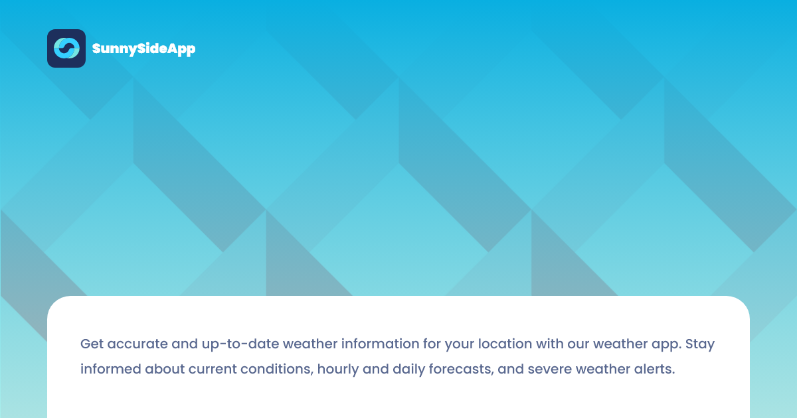

SunnySideApp is a user-friendly web application that provides you with up-to-date weather information. Built with HTML, Vue, and Sass, SunnySideApp offers hourly and 7-day forecasts to help you plan your day accordingly. Whether you need to know if it's safe to go out for a jog, plan a picnic with friends, or simply check the weather, SunnySideApp makes it easy and accessible for you.

# Special Thanks
Below are the open-source GitHub repos I used to build this project. You guys are awesome! If you are doing an open-source project, I would love to join in.

- [country-flags](https://github.com/hampusborgos/country-flags)
- [Open-Meteo Weather API](https://github.com/open-meteo/open-meteo)
- [Vue toast notification](https://github.com/ankurk91/vue-toast-notification)
